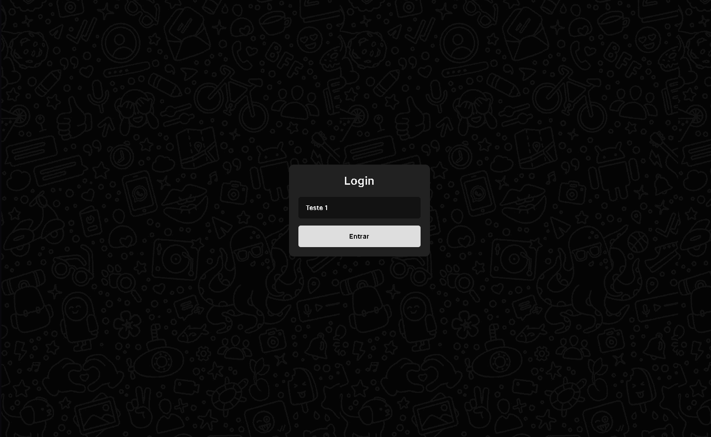

# 💬 Real-Time Chat (WebSocket)



Um pequeno chat em tempo real feito com **Node.js** e **WebSockets**.
A aplicação permite que vários usuários se conectem e troquem mensagens instantaneamente diretamente pelo navegador.

O objetivo do projeto foi entender melhor **comunicação em tempo real**, **broadcast de mensagens** e o funcionamento básico de **WebSockets** em uma aplicação simples.

---

## Funcionalidades

* Mensagens em tempo real entre múltiplos usuários
* Identificação visual dos usuários com cores diferentes
* Mensagem automática quando alguém entra no chat
* Contador de usuários online atualizado em tempo real
* Interface simples focada na funcionalidade

---

## Tecnologias utilizadas

* **Node.js**
* **WebSocket (ws)**
* **JavaScript**
* **HTML**
* **CSS**

---

## Instalação

Clone o repositório:

```bash
git clone https://github.com/seuusuario/seurepositorio.git
```

Entre na pasta do projeto:

```bash
cd seurepositorio
```

Instale as dependências:

```bash
npm install
```

---

## Scripts disponíveis

No `package.json` existem dois scripts principais:

```json
"scripts": {
  "start": "node src/server.js",
  "dev": "node --watch src/server.js"
}
```

### Iniciar o servidor

```bash
npm start
```

### Modo desenvolvimento (reinício automático)

```bash
npm run dev
```

---

## Executando o projeto

Depois de iniciar o servidor, basta abrir o arquivo **index.html** no navegador.

Para testar o chat com mais de um usuário, abra o projeto em **várias abas ou janelas** do navegador.

---

## Como funciona

O servidor WebSocket recebe as mensagens enviadas pelos clientes e faz um **broadcast** para todos os usuários conectados.

O fluxo básico é:

1. Um usuário envia uma mensagem
2. O servidor recebe essa mensagem
3. O servidor retransmite para todos os clientes conectados
4. Cada cliente atualiza o chat em tempo real

O servidor também acompanha as conexões ativas para manter o **contador de usuários online** atualizado.

---

## Possíveis melhorias

Algumas ideias para evoluir o projeto no futuro:

* Lista de usuários conectados
* Indicação de **"usuário digitando..."**
* Histórico de mensagens
* Avatares de usuário
* Deploy da aplicação

---

## Licença

Este projeto está disponível sob a licença MIT.
